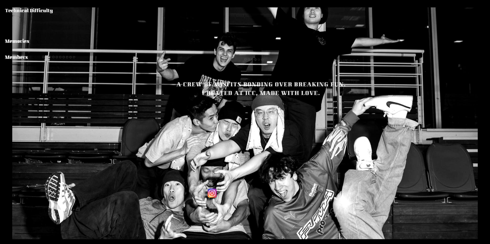

# **Technical Difficulty Official Website**

> **A Visual & Interactive Showcase of Technical Difficulty Crew**

## ** Live Website**

[ Visit Technical Difficulty Online](#) _(https://technicaldifficulty2022.com/)_  

## **Introduction**

This website serves as the official digital presence for **Technical Difficulty**, a breaking crew dedicated to pushing the boundaries of creativity and movement. The site functions as a **visual archive and interactive platform**, preserving the collective’s journey, members, and shared experiences.

## **Key Features**

### ** Immersive Design**

- A custom-designed UI with **monochrome aesthetics**, reflecting the crew’s underground and raw energy.
- **Responsive layout** ensuring a seamless experience on both desktop and mobile.

### ** Members Showcase**

- Individual profiles featuring **portraits, breaking names, and Instagram links**.
- A **dynamic grid layout** that rearranges for a natural viewing experience.

### ** Memories Archive**

- A **gallery of past events and jams**, dynamically fetched from Google Sheets.
- Hover effects and grayscale toggles to create a **timeless documentary feel**.

### ** Custom Animations**

- Subtle UI transitions to maintain a smooth **cinematic experience**.
- Interactive elements like a **floating Instagram logo** placed in a dynamic position.

### ** Deployed with Netlify**

- Optimized for **fast loading** and global accessibility.
- **Custom domain & HTTPS secured** for a professional online presence.

## ** Credits & Contact**

- **Concept & Execution:** Technical Difficulty Crew
- **Design & Development:** Zhe
- **Instagram:** [@technicaldifficulty2022](https://www.instagram.com/technicaldifficulty2022)

This site is an evolving archive. Stay tuned for future updates and more immersive storytelling.
